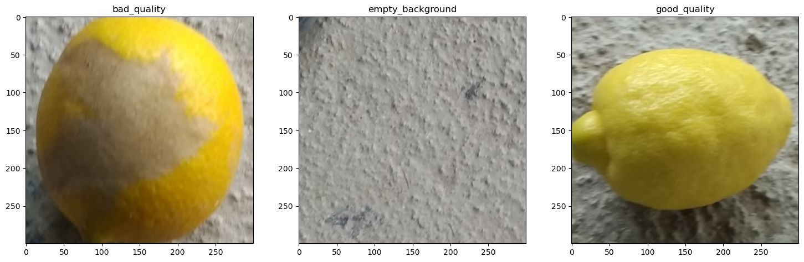
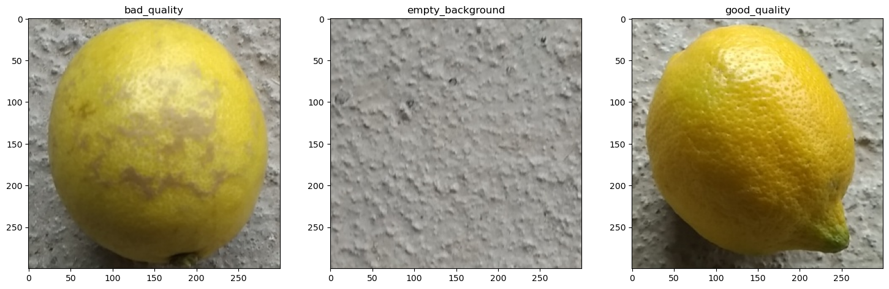

# Wise Lemon Selector [en]

A project about lemon quality detection.

We will try to recognise the quality of lemons from their images, using Deep Learning with Neural Networks, both from scratch and using Transfer Learning and Fine Tunning on well known networks such VGG16.

We can compare both methods and see what is the best strategy for our use case.

Here an example of what we are trying to detect:

To do this task, it is recommended  the use of a GPU for image calculations with Tensorflow library. In Google Colab, GPU computing can be selected directly in the notebook settings, while on a PC it is necessary to download and configure CUDA (for Nvidia GPUs)   

---

# Selector de limones inteligente [es]

Un proyecto consistente en averiguar la calidad de los limones.

Se tratará de identificar la calidad de los limones a partir de imágenes, para ello se usará Aprendizaje Profundo mediante redes neuronales, tanto creadas desde cero como a partir de redes neuronales muy conocidas como VGG16 a las que aplicaremos técnicas de transmision de conocimiento y ajuste fino de parámetros.

Podremos comparar ambos métodos y ver cual es la mejor estrategia a seguir en nuestro caso.

Veamos un ejemplo de lo que tratamos de conseguir:

Para llevar a cabo esta tarea, se recomienda la utilización de una GPU para los cálculos con imágenes de la librería Tensorflow. En Google Colab se puede seleccionar directamente en la configuración del cuaderno el cálculo con GPU, mientras que en un PC es necesario descargar y configurar CUDA (para GPUs de Nvidia).
